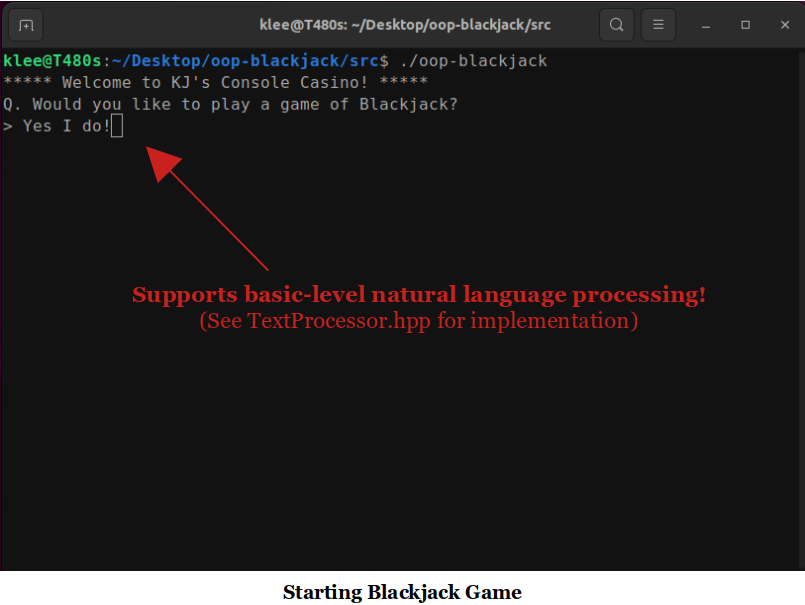
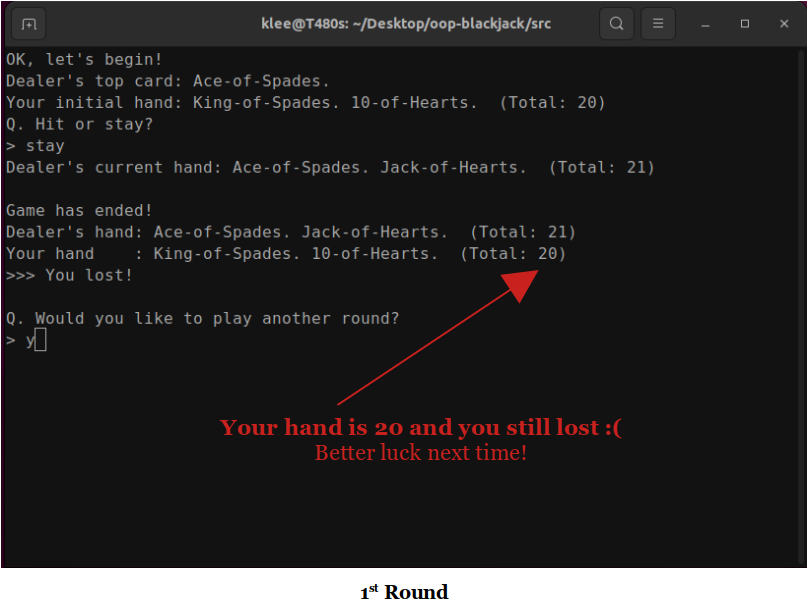
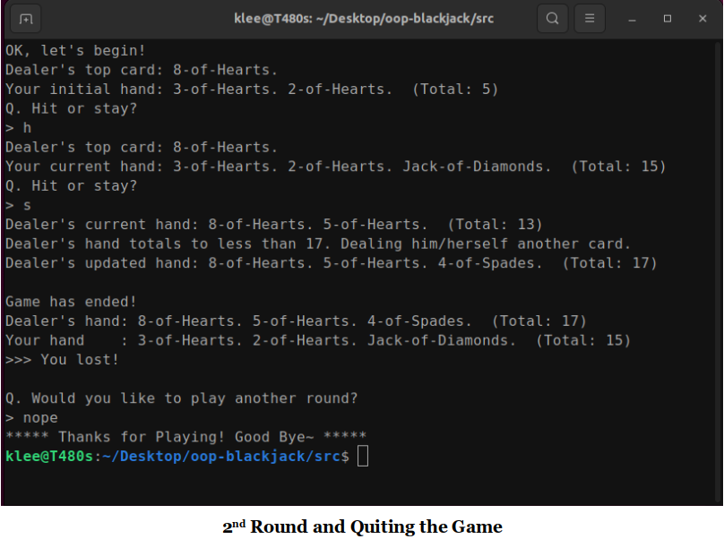
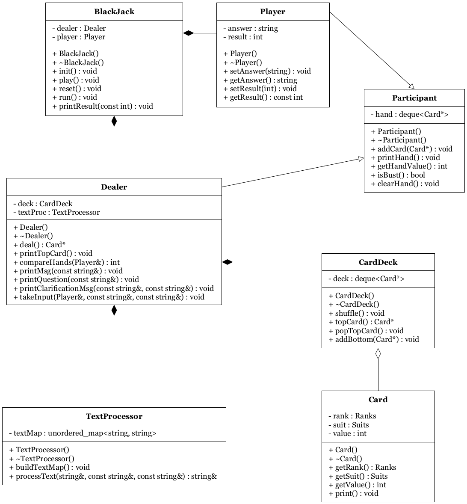
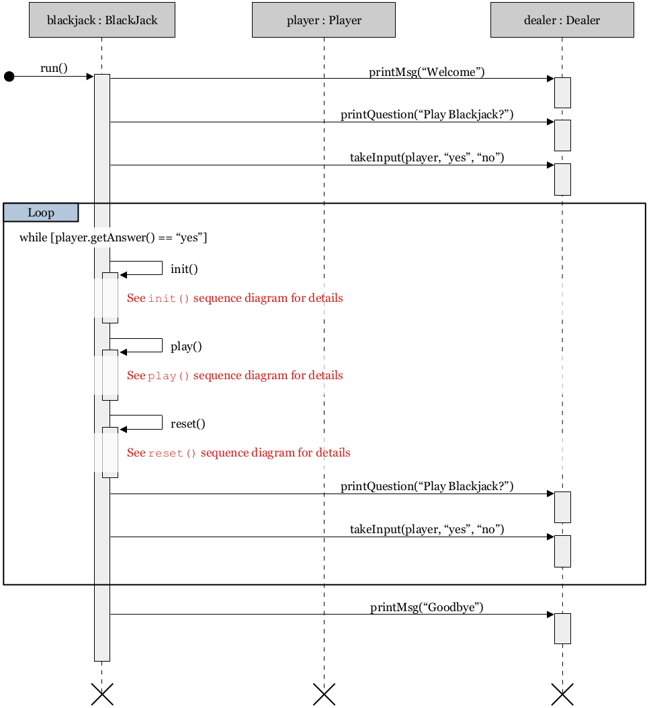
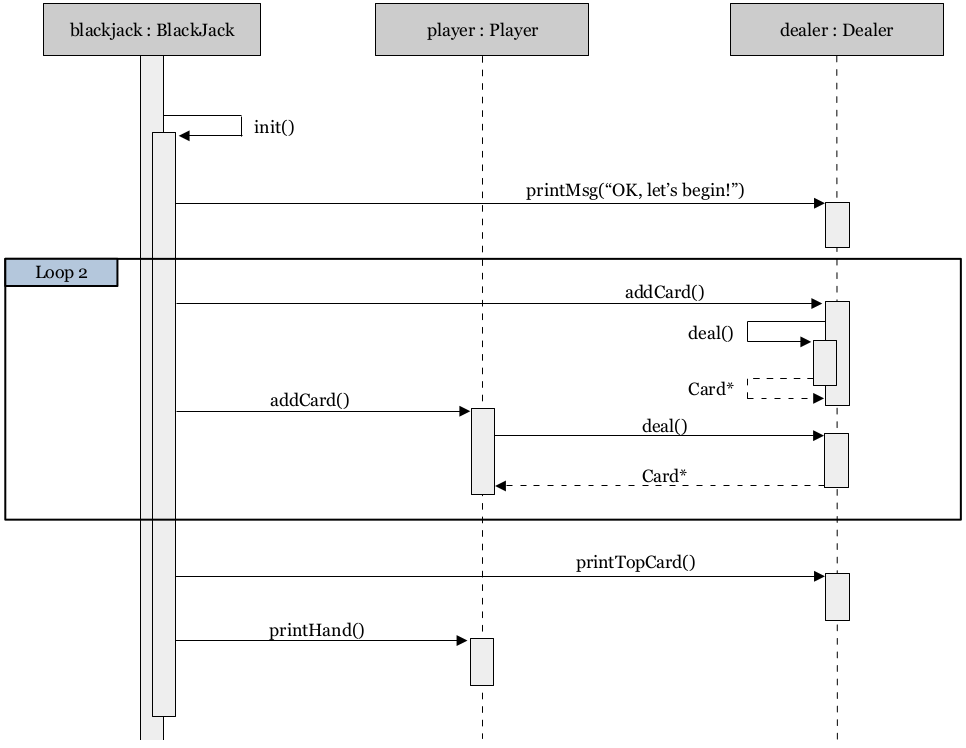
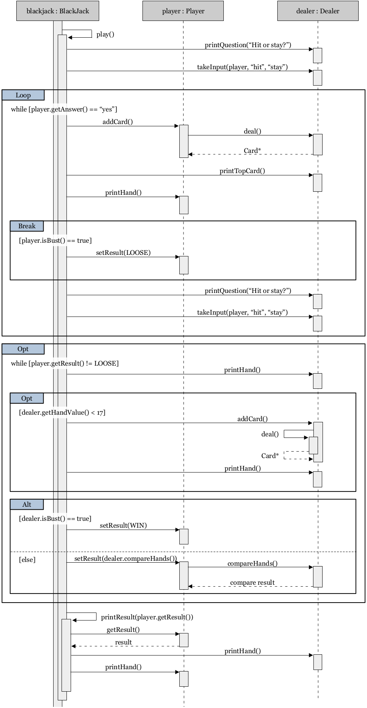
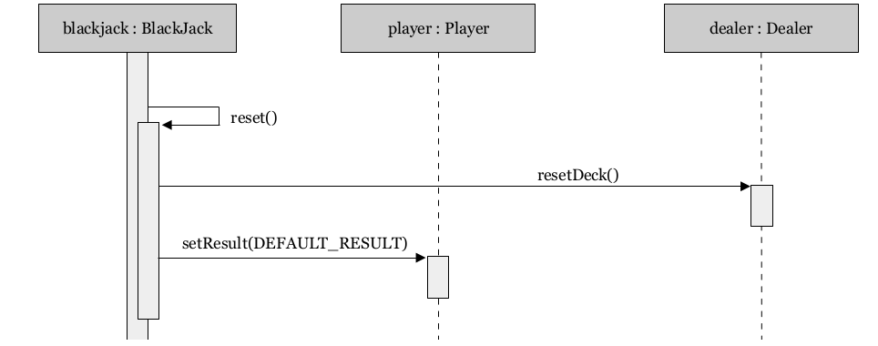

[Home](../../) | [Notes](../../notes) | [Projects](../) > Console Blackjack

# Console Blackjack 


## Introduction

An interactive console Blackjack game implemented using Objecct-Oriented Design (OOD) and programming (OOP) in C++


## Objective

* To experience Object-Oriented Design process in a software development process.
  * Generate $\to$ Relate $\to$ Eliminate $\to$ Iterate
  * UML class diagram
  * UML sequence diagram
* To get familiar with Object-Oriented Programming concepts.
  * 4 pillars of OOP - Encapsulation, Inheritance, Polymorphism, Abstraction


## Demonstration

[!] Note: Demonstration video is to be uploaded.

* In the meantime, following snapshots will give you an idea how it looks!











## Development Environment

* **Operating System**

  Ubuntu 22.04.1 LTS (Kernel version: 5.15.0-52-generic)

* **Compiler**

  GCC version 11.3.0 (Ubuntu 11.3.0-1ubuntu1~22.04)

* **Debugger**

  GDB version 12.0.90 (Ubuntu 12.0.90-0ubuntu1)

[!] Note: This application compiles and runs on both **Linux** and **Windows** operating systems.


## Object-Oriented Design (OOD)

### UML Class Diagram



### UML Sequence Diagram

* **Sequence Diagram $$-$$ `run()`**





* **Sequence Diagram $$-$$ `init()`**





* **Sequence Diagram $$-$$ `play()`**





* **Sequence Diagram $$-$$ `reset()`**





## Source Code

* **main_Blackjack.cpp (Test Driver)**

  ```cpp
  //========================================================================================
  // File Name    : main_Backjack.cpp
  // Description  : OOP C++ BlackJack Program - Driver
  // Author       : Kyungjae Lee
  // History      : 11/08/2022 - File created.
  //========================================================================================
  
  #include <iostream>
  #include "BlackJack.hpp"
  
  int main(int argc, char *argv[])
  {
      BlackJack blackjack;
  
      blackjack.run();
  
      return 0;
  }
  ```

* **Blackjack.hpp**

  ```cpp
  //========================================================================================
  // File Name    : BlackJack.hpp
  // Description  : OOP C++ BlackJack Program - BlackJack class implementation
  // Author       : Kyungjae Lee
  // History      : 11/03/2022 - File created.
  //========================================================================================
  
  #ifndef BLACKJACK_HPP
  #define BLACKJACK_HPP
  
  #include "Dealer.hpp"
  #include "Player.hpp"
  
  #define WIN     1
  #define TIE     0
  #define LOOSE  -1
  
  class BlackJack
  {
  public:
      BlackJack();
      ~BlackJack();
      void init();
      void play();
      void reset();
      void run();
      void printResult(const int) const;
  
  private:
      Dealer dealer;
      Player player;
  };
  
  // default constructor
  BlackJack::BlackJack()
  {
      // empty
  }
  
  // destructor
  BlackJack::~BlackJack()
  {
      // empty
  }
  
  // initializes the Blackjack game
  void BlackJack::init()
  {
      // screen clear for Windows OS
      #ifdef _WIN32
          std::system("cls");
      #else
          std::system("clear");
      #endif
  
      dealer.printMsg("OK, let's begin!");
  
      // dealer deals initial hand
      for (int i = 0; i < 2; ++i)
      {
          dealer.addCard(dealer.deal());
          player.addCard(dealer.deal());
      }
  
      // print the dealer's hand (top card only) and palyer's hand
      std::cout << "Dealer's top card: "; dealer.printTopCard(); std::cout << std::endl;
      std::cout << "Your initial hand: "; player.printHand(); std::cout << std::endl;
  }
  
  // plays the Blackjack game
  void BlackJack::play()
  {
      // ask the player to choose between hit or stay
      dealer.printQuestion("Q. Hit or stay?");
      dealer.takeInput(player, "hit", "stay");
  
      while (player.getAnswer() == "hit")
      {
          // dealer deals another card to the player
          player.addCard(dealer.deal());
  
          // print the dealer's hand (top card only) and palyer's hand
          std::cout << "Dealer's top card: "; dealer.printTopCard(); std::cout << std::endl;
          std::cout << "Your current hand: "; player.printHand(); std::cout << std::endl;
  
          // if the player goes bust
          if (player.isBust())
          {
              player.setResult(LOOSE);    // set the player's game result as LOOSE
              break;
          }
  
          // ask the user to choose between hit or stay
          dealer.printQuestion("Q. Hit or stay?");
          dealer.takeInput(player, "hit", "stay");
      }
  
      // if the player stays
      if (player.getResult() != LOOSE)
      {
          std::cout << "Dealer's current hand: "; dealer.printHand(); std::cout << std::endl;
  
          // if dealer's hand value totals to less than 17
          if (dealer.getHandValue() < 17)
          {
              std::cout << "Dealer's hand totals to less than 17. "
                        << "Dealing him/herself another card." << std::endl;
  
              dealer.addCard(dealer.deal());  // deal him/herself another card
  
              // print the dealer's updated hand
              std::cout << "Dealer's updated hand: "; dealer.printHand(); std::cout << std::endl;
          }
  
          // if the dealer goes bust
          if (dealer.isBust())
              player.setResult(WIN);  // set the player's game result to WIN
          // if both dealer and player is alive, compare hands and set player's game result
          // accordingly
          else
              player.setResult(dealer.compareHands(player));
      }
  
      // print the game result
      std::cout << std::endl; printResult(player.getResult()); std::cout << std::endl;
  }
  
  // resets the card deck and player's game result for (potentially) the next game
  void BlackJack::reset()
  {
      dealer.resetDeck(player);
      player.setResult(DEFAULT_RESULT);  // DEFAULT_RESULT is any value that is not -1, 0, 1
  }
  
  // runs the Blackjack game
  void BlackJack::run()
  {
      // print the welcome message
      dealer.printMsg("***** Welcome to KJ's Console Casino! *****");
      dealer.printQuestion("Q. Would you like to play a game of Blackjack?");
      dealer.takeInput(player, "yes", "no");
  
      while (player.getAnswer() == "yes")
      {
          init();
          play();
          reset();
  
          // ask the player if he/she wants to play the game again and read in the input
          dealer.printQuestion("Q. Would you like to play another round?");
          dealer.takeInput(player, "yes", "no");
      }
  
      // print the goodbye message
      dealer.printMsg("***** Thanks for Playing! Good Bye~ *****");
  }
  
  // prints the game result
  void BlackJack::printResult(const int result) const
  {
      int value;
      std::cout << "Game has ended!" << std::endl;
      std::cout << "Dealer's hand: "; dealer.printHand(); std::cout << std::endl;
      std::cout << "Your hand    : "; player.printHand(); std::cout << std::endl;
  
      if (result == WIN)
          std::cout << ">>> You win!" << std::endl;
      else if (result == TIE)
          std::cout << ">>> It's a tie!" << std::endl;
      else
          std::cout << ">>> You lost!" << std::endl;
  }
  
  #endif
  ```

* **Participants.hpp**

  ```cpp
  //========================================================================================
  // File Name    : BlackJack.hpp
  // Description  : OOP C++ BlackJack Program - BlackJack class implementation
  // Author       : Kyungjae Lee
  // History      : 11/03/2022 - File created.
  //========================================================================================
  
  #ifndef BLACKJACK_HPP
  #define BLACKJACK_HPP
  
  #include "Dealer.hpp"
  #include "Player.hpp"
  
  #define WIN     1
  #define TIE     0
  #define LOOSE  -1
  
  class BlackJack
  {
  public:
      BlackJack();
      ~BlackJack();
      void init();
      void play();
      void reset();
      void run();
      void printResult(const int) const;
  
  private:
      Dealer dealer;
      Player player;
  };
  
  // default constructor
  BlackJack::BlackJack()
  {
      // empty
  }
  
  // destructor
  BlackJack::~BlackJack()
  {
      // empty
  }
  
  // initializes the Blackjack game
  void BlackJack::init()
  {
      // screen clear for Windows OS
      #ifdef _WIN32
          std::system("cls");
      #else
          std::system("clear");
      #endif
  
      dealer.printMsg("OK, let's begin!");
  
      // dealer deals initial hand
      for (int i = 0; i < 2; ++i)
      {
          dealer.addCard(dealer.deal());
          player.addCard(dealer.deal());
      }
  
      // print the dealer's hand (top card only) and palyer's hand
      std::cout << "Dealer's top card: "; dealer.printTopCard(); std::cout << std::endl;
      std::cout << "Your initial hand: "; player.printHand(); std::cout << std::endl;
  }
  
  // plays the Blackjack game
  void BlackJack::play()
  {
      // ask the player to choose between hit or stay
      dealer.printQuestion("Q. Hit or stay?");
      dealer.takeInput(player, "hit", "stay");
  
      while (player.getAnswer() == "hit")
      {
          // dealer deals another card to the player
          player.addCard(dealer.deal());
  
          // print the dealer's hand (top card only) and palyer's hand
          std::cout << "Dealer's top card: "; dealer.printTopCard(); std::cout << std::endl;
          std::cout << "Your current hand: "; player.printHand(); std::cout << std::endl;
  
          // if the player goes bust
          if (player.isBust())
          {
              player.setResult(LOOSE);    // set the player's game result as LOOSE
              break;
          }
  
          // ask the user to choose between hit or stay
          dealer.printQuestion("Q. Hit or stay?");
          dealer.takeInput(player, "hit", "stay");
      }
  
      // if the player stays
      if (player.getResult() != LOOSE)
      {
          std::cout << "Dealer's current hand: "; dealer.printHand(); std::cout << std::endl;
  
          // if dealer's hand value totals to less than 17
          if (dealer.getHandValue() < 17)
          {
              std::cout << "Dealer's hand totals to less than 17. "
                        << "Dealing him/herself another card." << std::endl;
  
              dealer.addCard(dealer.deal());  // deal him/herself another card
  
              // print the dealer's updated hand
              std::cout << "Dealer's updated hand: "; dealer.printHand(); std::cout << std::endl;
          }
  
          // if the dealer goes bust
          if (dealer.isBust())
              player.setResult(WIN);  // set the player's game result to WIN
          // if both dealer and player is alive, compare hands and set player's game result
          // accordingly
          else
              player.setResult(dealer.compareHands(player));
      }
  
      // print the game result
      std::cout << std::endl; printResult(player.getResult()); std::cout << std::endl;
  }
  
  // resets the card deck and player's game result for (potentially) the next game
  void BlackJack::reset()
  {
      dealer.resetDeck(player);
      player.setResult(DEFAULT_RESULT);  // DEFAULT_RESULT is any value that is not -1, 0, 1
  }
  
  // runs the Blackjack game
  void BlackJack::run()
  {
      // print the welcome message
      dealer.printMsg("***** Welcome to KJ's Console Casino! *****");
      dealer.printQuestion("Q. Would you like to play a game of Blackjack?");
      dealer.takeInput(player, "yes", "no");
  
      while (player.getAnswer() == "yes")
      {
          init();
          play();
          reset();
  
          // ask the player if he/she wants to play the game again and read in the input
          dealer.printQuestion("Q. Would you like to play another round?");
          dealer.takeInput(player, "yes", "no");
      }
  
      // print the goodbye message
      dealer.printMsg("***** Thanks for Playing! Good Bye~ *****");
  }
  
  // prints the game result
  void BlackJack::printResult(const int result) const
  {
      int value;
      std::cout << "Game has ended!" << std::endl;
      std::cout << "Dealer's hand: "; dealer.printHand(); std::cout << std::endl;
      std::cout << "Your hand    : "; player.printHand(); std::cout << std::endl;
  
      if (result == WIN)
          std::cout << ">>> You win!" << std::endl;
      else if (result == TIE)
          std::cout << ">>> It's a tie!" << std::endl;
      else
          std::cout << ">>> You lost!" << std::endl;
  }
  
  #endif
  ```

* **Dealer.hpp**

  ```cpp
  //========================================================================================
  // File Name    : Dealer.hpp
  // Description  : OOP C++ BlackJack Program - Dealer class implementation
  //                - Dealer class is a derived class of Participant class
  // Author       : Kyungjae Lee
  // History      : 11/03/2022 - File created.
  //                11/08/2022 - Text processor functionality separated to independent
  //                             module.
  //========================================================================================
  
  #ifndef DEALER_HPP
  #define DEALER_HPP
  
  #include <unordered_map>
  #include "CardDeck.hpp"
  #include "Participant.hpp"
  #include "TextProcessor.hpp"
  
  class Dealer : public Participant
  {
  public:
      Dealer();
      ~Dealer();
      Card* deal();
      void printTopCard() const;
      int compareHands(Player&) const;
      void resetDeck(Player&);
      void printMsg(const std::string&) const;
      void printQuestion(const std::string&) const;
      void printClarificationMsg(const std::string&, const std::string&) const;
      void takeInput(Player&, const std::string&, const std::string&);
  
  private:
      CardDeck deck;
      TextProcessor textProc; // processes player's natural language text input
  };
  
  // default constructor
  Dealer::Dealer()
      : deck()
  {
      // empty
  }
  
  // destructor
  Dealer::~Dealer()
  {
      // empty
  }
  
  // deals (returns) the top card of the card deck
  // - receiver of the dealt card should process the card from its end
  Card* Dealer::deal()
  {
      Card *pcard = deck.topCard();
      deck.popTopCard();
  
      return pcard;
  }
  
  // prints the top card to the screen
  void Dealer::printTopCard() const
  {
      hand.front()->print(); std::cout << ".";
  }
  
  // compares the dealer's hand with the player's hand and returns the result
  int Dealer::compareHands(Player& player) const
  {
      if (player.getHandValue() > getHandValue())
          return 1;
      else if (player.getHandValue() == getHandValue())
          return 0;
      else
          return -1;
  }
  
  // resets the card deck
  void Dealer::resetDeck(Player& player)
  {
      for (Card* pcard : player.hand)
          deck.addBottom(pcard);
  
      for (Card* pcard : hand)
          deck.addBottom(pcard);
  
      player.hand.clear();
      hand.clear();
  
      deck.shuffle();
  }
  
  // prints the passed message to the screen (non-question type)
  void Dealer::printMsg(const std::string& message) const
  {
      std::cout << message << std::endl;
  }
  
  // prints the passed question to the screen (question type)
  void Dealer::printQuestion(const std::string& question) const
  {
      std::cout << question << std::endl << "> ";
  }
  
  // prints the clarification message to the screen
  // - this should be called when the processed answer of the player does not match any
  //   keywords registered in the textMap
  void Dealer::printClarificationMsg(const std::string& expected1,
      const std::string& expected2) const
  {
      std::cout << "Q. I'm sorry, was that a " << expected1 << " or " << expected2 << "?"
                << std::endl << "> ";
  }
  
  // takes the player's input and processes it
  void Dealer::takeInput(Player& player, const std::string& expected1,
      const std::string& expected2)
  {
      std::string input;
      std::getline(std::cin, input);
  
      // asks for player's input repeatedly until the input is recognized by processText()
      while ((input = textProc.processText(input, expected1, expected2)) == "TEXT NOT RECOGNIZABLE")
      {
          printClarificationMsg(expected1, expected2);
          std::getline(std::cin, input);
      }
  
      // sets the player's member variable 'answer' to the recognized and processed input
      player.setAnswer(input);
  }
  
  #endif
  ```

* **Player.hpp**

  ```cpp
  //========================================================================================
  // File Name    : Player.hpp
  // Description  : OOP C++ BlackJack Program - Player class implementation
  //                - Player class is a derived class of Participant class
  // Author       : Kyungjae Lee
  // History      : 11/03/2022 - File created.
  //========================================================================================
  
  #ifndef PLAYER_HPP
  #define PLAYER_HPP
  
  #include "CardDeck.hpp"
  #include "Participant.hpp"
  
  #define DEFAULT_RESULT 2    // can be any value that is not -1(loose), 0(tie), or win(1)
  
  class Player : public Participant
  {
  public:
      Player();
      ~Player();
      void setAnswer(std::string);
      const std::string getAnswer() const;
      void setResult(int);
      const int getResult() const;
  
  private:
      std::string answer;     // stores the player's answer to the dealer's question
      int result;             // stores the player's game result (win, tie, loose)
  
      friend class Dealer;    // enables dealer's access to player's hand when resetting
  };
  
  // default constructor
  Player::Player()
      : result(DEFAULT_RESULT)
  {
      // empty
  }
  
  // destructor
  Player::~Player()
  {
      // empty
  }
  
  // sets the player's answer to the passed string
  void Player::setAnswer(std::string answer)
  {
      this->answer = answer;
  }
  
  // gets the player's answer
  const std::string Player::getAnswer() const
  {
      return answer;
  }
  
  // sets the player's game result to the passed integer value
  void Player::setResult(int result)
  {
      this->result = result;
  }
  
  // gets the player's game result
  const int Player::getResult() const
  {
      return result;
  }
  
  #endif
  ```

* **Card.hpp**

  ```cpp
  //========================================================================================
  // File Name    : Card.hpp
  // Description  : OOP C++ BlackJack Program - Card class implementation
  // Author       : Kyungjae Lee
  // History      : 11/03/2022 - File created.
  //========================================================================================
  
  #ifndef CARD_HPP
  #define CARD_HPP
  
  class Card
  {
  public:
      enum Suits {
          HEARTS, DIAMONDS, CLUBS, SPADES
      };
      enum Ranks {
          TWO = 2, THREE, FOUR, FIVE, SIX, SEVEN, EIGHT, NINE, TEN, JACK, QUEEN, KING, ACE
      };
      Card(Ranks, Suits);
      ~Card();
      Ranks getRank() const;
      Suits getSuit() const;
      int getValue() const;
      void print() const;
  
  private:
      Ranks rank;
      Suits suit;
      int value;
  };
  
  // parameterized constructor
  Card::Card(Ranks r, Suits s)
      : rank(r), suit(s)
  {
      // empty
  }
  
  // destructor
  Card::~Card()
  {
      // empty
  }
  
  // gets the rank of the card
  Card::Ranks Card::getRank() const
  {
      return rank;
  }
  
  // gets the suit of the card
  Card::Suits Card::getSuit() const
  {
      return suit;
  }
  
  // gets the value of the card
  int Card::getValue() const
  {
      if (rank <= TEN)
          return rank;
      else if (rank == JACK)
          return 10;
      else if (rank == QUEEN)
          return 10;
      else if (rank == KING)
          return 10;
      else
          return 11;  // ACE will be evaluted to 1 if necessary by the participants
  }
  
  // prints the card to the screen
  void Card::print() const
  {
      if (rank <= TEN)
          std::cout << rank;
      else if (rank == JACK)
          std::cout << "Jack";
      else if (rank == QUEEN)
          std::cout << "Queen";
      else if (rank == KING)
          std::cout << "King";
      else
          std::cout << "Ace";
  
      std:: cout << "-of-";
  
      if (suit == HEARTS)
          std::cout << "Hearts";
      else if (suit == DIAMONDS)
          std::cout << "Diamonds";
      else if (suit == CLUBS)
          std::cout << "Clubs";
      else
          std::cout << "Spades";
  }
  
  #endif
  ```

* **CardDeck.hpp**

  ```cpp
  //========================================================================================
  // File Name    : CardDeck.hpp
  // Description  : OOP C++ BlackJack Program - CardDeck class implementation
  // Author       : Kyungjae Lee
  // History      : 11/03/2022 - File created.
  //========================================================================================
  
  #ifndef CARDDECK_HPP
  #define CARDDECK_HPP
  
  #include <deque>
  #include <algorithm>    // shuffle
  #include <random>       // default_randome_engine
  #include <ctime>        // time
  #include "Card.hpp"
  #include "Player.hpp"
  
  class CardDeck
  {
  public:
      CardDeck();
      ~CardDeck();
      void shuffle();
      Card* topCard();
      void popTopCard();
      void addBottom(Card*);
  
  private:
      std::deque<Card*> deck;
  };
  
  // default constructor
  CardDeck::CardDeck()
      : deck()
  {
      for (int r = 2; r <= 14; ++r)
      {
          for (int s = 0; s <= 3; ++s)
              deck.push_back(new Card(static_cast<Card::Ranks>(r), static_cast<Card::Suits>(s)));
      }
  
      shuffle();
  }
  
  // destructor
  CardDeck::~CardDeck()
  {
      for (Card* pcard : deck)
          delete pcard;
  
      deck.clear();
  }
  
  // shuffles the card deck
  void CardDeck::shuffle()
  {
      std::shuffle(deck.begin(), deck.end(), std::default_random_engine(time(NULL)));
  }
  
  // returns the top card in the deck
  Card* CardDeck::topCard()
  {
      return deck.front();
  }
  
  // removes the top card from the card deck
  void CardDeck::popTopCard()
  {
      deck.pop_front();
  }
  
  // add the passed card to the bottom of the card deck
  void CardDeck::addBottom(Card* pcard)
  {
      return deck.push_back(pcard);
  }
  
  #endif
  ```

* **TextProcessor.hpp**

  ```cpp
  //========================================================================================
  // File Name    : TextProcessor.hpp
  // Description  : OOP C++ BlackJack Program - TextProcessor class implementation
  //                - TextProcessor processes player's natural language input text
  // Author       : Kyungjae Lee
  // History      : 11/08/2022 - File created.
  //========================================================================================
  
  #ifndef TEXTPROCESSOR_HPP
  #define TEXTPROCESSOR_HPP
  
  #include <unordered_map>
  #include "sstream"
  
  class TextProcessor
  {
  public:
      TextProcessor();
      ~TextProcessor();
      void buildTextMap();
      std::string& processText(std::string&, const std::string&, const std::string&);
  
  private:
      std::unordered_map<std::string, std::string> textMap;
  };
  
  // default constructor
  TextProcessor::TextProcessor()
      : textMap()
  {
      buildTextMap();
  }
  
  // destructor
  TextProcessor::~TextProcessor()
  {
      // empty
  }
  
  // builds the textMap
  // - this textMap will be used for natural language processing
  void TextProcessor::buildTextMap()
  {
      textMap["yes"]          = "yes";
      textMap["y"]            = "yes";
      textMap["sure"]         = "yes";
      textMap["yeah"]         = "yes";
      textMap["yeap"]         = "yes";
      textMap["yup"]          = "yes";
      textMap["please"]       = "yes";
      textMap["of course"]    = "yes";
      textMap["nope"]         = "no";
      textMap["nah"]          = "no";
      textMap["no"]           = "no";
      textMap["n"]            = "no";
      textMap["hit"]          = "hit";
      textMap["h"]            = "hit";
      textMap["stay"]         = "stay";
      textMap["stop"]         = "stay";
      textMap["s"]            = "stay";
  }
  
  // processes the natural language passed as a string, returns the processing result
  // - takes the user input string, matches it with the expected answers registered in the
  //   textMap, returns the processed answer if the match was successful,
  //   "TEXT NOT RECOGNIZABLE" otherwise
  std::string& TextProcessor::processText(std::string& input, const std::string& expected1,
      const std::string& expected2)
  {
      std::vector<std::string> tokens;
      std::string token;
  
      // switch all characters of the input string to lower case
      for (auto& ch : input)
          ch = tolower(ch);
  
      std::stringstream ss(input);
  
      // tokenize the input string, search each token for its match in the textMap
      while (getline(ss, token, ' '))
          tokens.push_back(token);
  
      // if matched, return the matched string's pre-defined meaning
      for (auto tok : tokens)
      {
          if (textMap.find(tok) != textMap.end())
          {
              input = textMap[tok];
              break;
          }
      }
  
      // if the processed input matches any of the expected strings
      if (input == expected1 || input == expected2)
          return input;   // return the input
  
      // if the processed input does not match any of the expected strings
      input = "TEXT NOT RECOGNIZABLE";    // signal the caller
      return input;
  }
  
  #endif
  ```