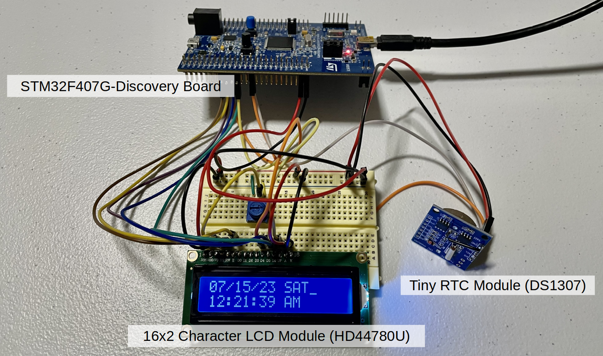
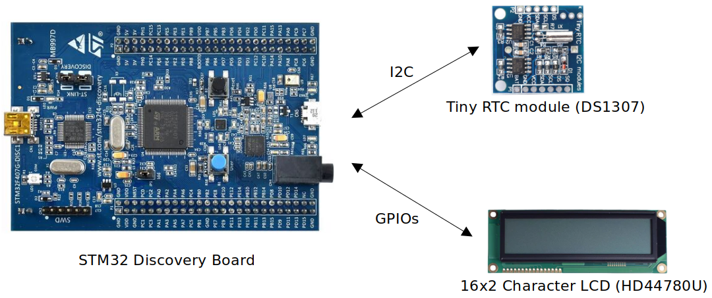
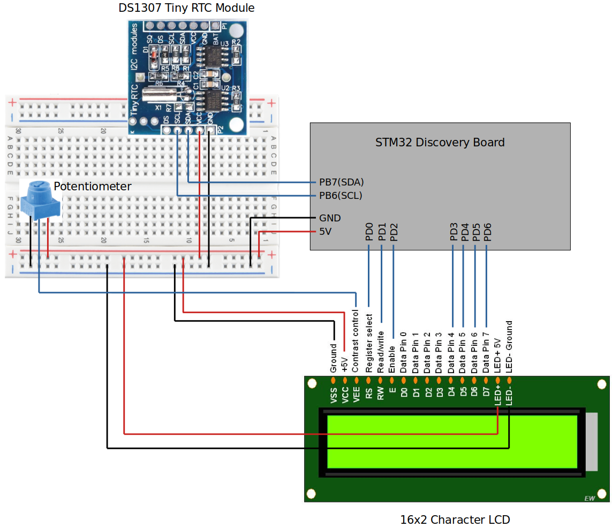
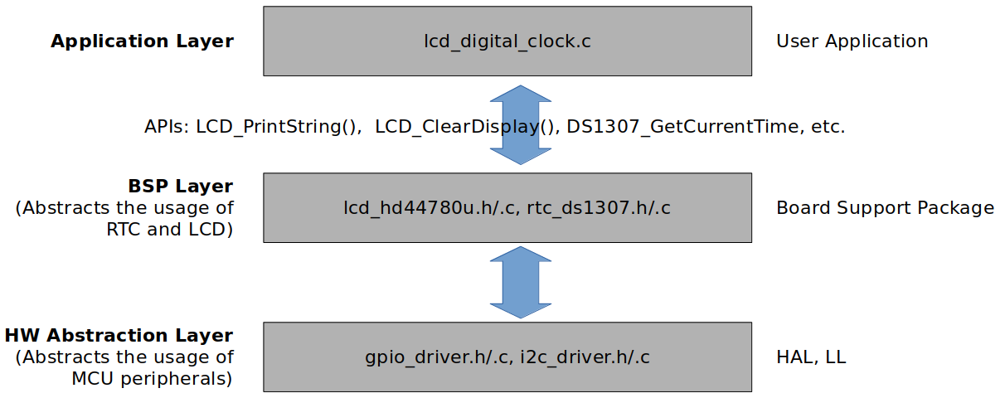

[Home](../../) | [Notes](../../notes) | [Projects](../) > LCD Digital Clock

# LCD Digital Clock 

Source code: [https://github.com/kyungjae-lee/lcd-digital-clock](https://github.com/kyungjae-lee/lcd-digital-clock).

## Introduction

* Designed the system architecture and developed all software layers (hardware abstraction, BSP, application) to implement an LCD digital clock, which displays time and date information in real‐time
* Used STM32CubeIDE for software development and debugging, and a logic analyzer for testing

## Demonstration

<iframe width="560" height="315" src="https://www.youtube.com/embed/3YQeoxAJBNw" title="YouTube video player" frameborder="0" allow="accelerometer; autoplay; clipboard-write; encrypted-media; gyroscope; picture-in-picture; web-share" allowfullscreen></iframe>

## Development Environment

* Operating system: Ubuntu 22.04 LTS
* Integrated Development Environment (IDE): STM32 CubeIDE Version 1.10.1

## Architecture

### Hardware Components

### Communication Interfaces

### Wiring

### Software Layers

* **Application layer** implements the logic to read the  current time and data information from the RTC  module and display it on the LCD using the APIs provided by the  underlying software layers.
* **BSP layer** provides the Application layer with APIs to control the Tiny RTC (DS1307) Module and the 16x2 Character LCD (HD44780U).
* **Hardware abstraction layer** provides the BSP layer with APIs to control the MCU peripherals such as GPIO, I2C, and USART.