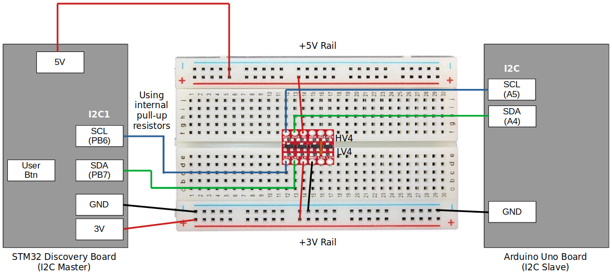
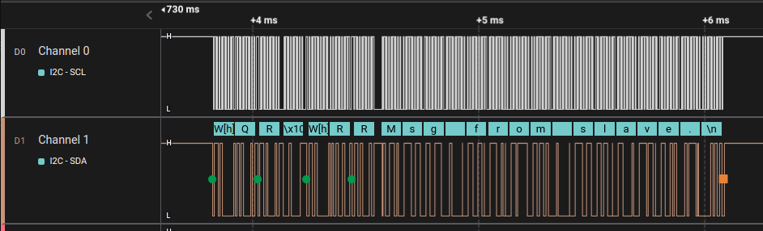
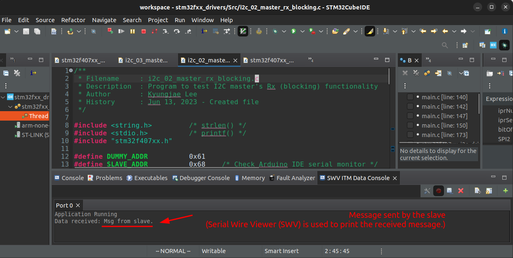

[Home](../../) | [Notes](../../notes) | [Projects](../) > MCU Peripheral Drivers

# MCU Peripheral Drivers 

Source code: [https://github.com/kyungjae-lee/mcu-peripheral-drivers](https://github.com/kyungjae-lee/mcu-peripheral-drivers)

## Introduction

* Developed MCU peripheral drivers (GPIO, SPI, I2C, USART) from scratch on the STM32F407G-Discovery board, along with comprehensive test applications to ensure their reliability and applicability for real‐world projects
* Used STM32CubeIDE for software development, a logic analyzer for testing, and the on‐board ST‐LINK/V2 debug
  circuitry for debugging
* Please see the [LCD Digital Clock](./lcd-digital-clock) project to observe how these drivers are utilized in a real-world embedded systems project

## Development Environment

* Operating system: Ubuntu 22.04 LTS
* Integrated Development Environment (IDE): STM32 CubeIDE Version 1.10.1

## Architecture

### Software Layers

* **Application layer** consists of test applications designed to verify the proper functionality of the GPIO, SPI, I2C, and  USART peripheral drivers for the STM32F407xx MCU.
* **Hardware abstraction layer** includes the device-specific header file for STM32F407xx MCU, along with the GPIO, SPI,  I2C, and USART peripheral drivers. This layer provides the application layer with a range of APIs to control the respective MCU peripherals.

## Testing (I2C Example)

* The following example is taken from one of the I2C peripheral driver tests. For additional tests on various other MCU peripheral drivers, please visit the [MCU Peripheral Drivers](https://jackklee.com/mcu-peripheral-drivers/) section on my notebook.

### Communication Interfaces

### Wiring

### Analysis using the Logic Analyzer

### Cross-checking using the STM32CubeIDE Data Console

