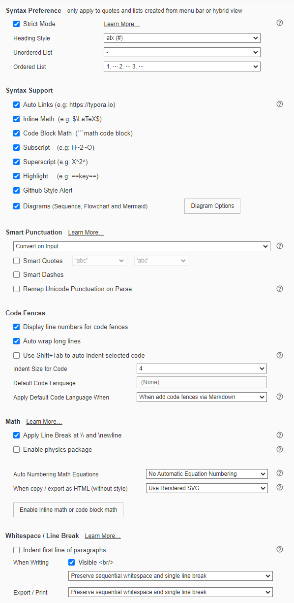

[Home](../../) | [Notes](../../notes) | [Projects](../) > Website

# Website

[https://kyungjae.com](https://kyungjae.com)


## Introduction

- Created and maintaining a documentation website for publishing  reusable technical information gained through personal studies and   projects
- Used **Markdown** to create and format the content, **Jekyll** to generate the website, and **GitHub Pages** to host it


## Typora Settings

* File -> Preferences -> Export -> HTML

  * Append in \<head />

    ```plain
    <title>Kyungjae's Website</title>
    <link rel="icon" type="image/x-icon" href="img/favicon.png">
    ```

    > Optimal size of favicon image: 32x32 px

  * Append in \<body />

    ```plain
    <footer>
    <p style="text-align: center;"><i>- Original works by Kyungjae Lee -</i></p>
    </footer> 
    ```

* File -> Preferences -> Markdown

  
